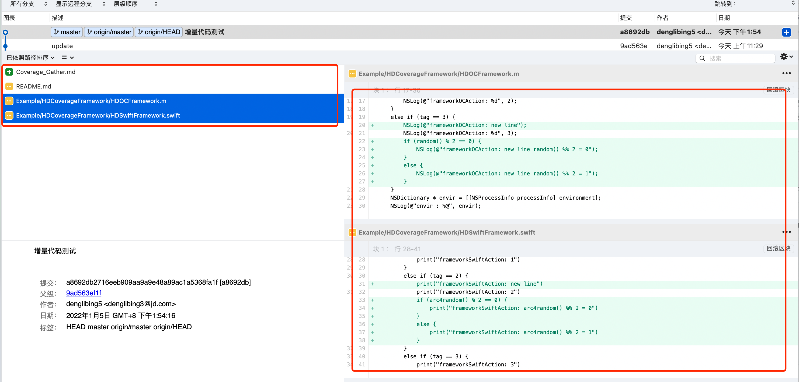
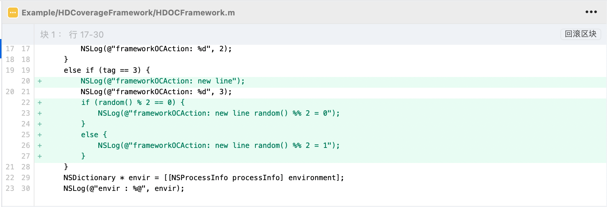
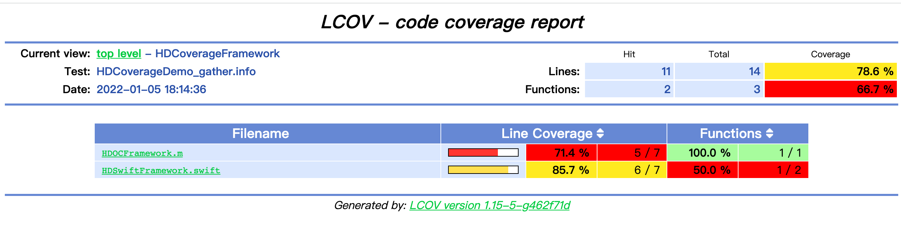
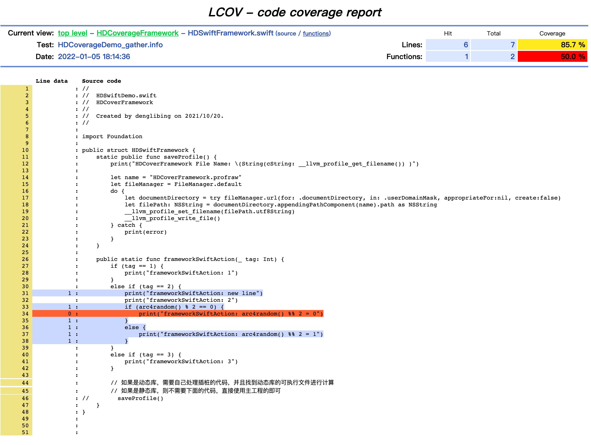

# 增量代码覆盖率

> 全量代码覆盖率可以直观的看到整个App的代码的覆盖率情况，但是往往有用的或者被关注的是增量代码覆盖率数据。经过不断的学习和探索，发现在基于git diff能力，通过一系列的处理获取我们想要的增量的信息，结合覆盖率信息，得到一份增量的覆盖率信息。

## 一、获取代码diff

> 这里依旧以本工程demo为例进行说明

#### 1、找到两次提交确认增量代码

通过 `git log` 找到最近一次（多次）的改动日志：

```sh
$ git log
commit a8692db2716eeb909aa9a9e48a89ac1a5368fa1f (HEAD -> master, origin/master, 
origin/HEAD)
Author: denglibing5 <denglibing3@jd.com>
Date:   Wed Jan 5 13:54:16 2022 +0800

    增量代码测试

commit 9ad563ef1f3f1306aeec9c409d354cd695b1003b
Author: denglibing5 <denglibing3@jd.com>
Date:   Wed Jan 5 11:29:43 2022 +0800

    update
```

`a8692db2716eeb909aa9a9e48a89ac1a5368fa1f` 这次的修改文件如下：



#### 2、输出增量代码信息

通过 `git diff` 输出增量代码信息，这里以 `commitid`  进行简单验证：

```sh
# 取完整commitid的前七位即可
$ git diff 9ad563e a8692db

diff --git a/Coverage_Gather.md b/Coverage_Gather.md
new file mode 100644
index 0000000..2774839
--- /dev/null
+++ b/Coverage_Gather.md
@@ -0,0 +1,22 @@
+# 增量代码覆盖率
+
+> 全量代码覆盖率可以直观的看到整个App的代码的覆盖率情况，但是往往有效或者被关注的是增量代码覆盖率数据，这里是基于git能力，通过一系列的处理获取我们想要的增量的信
息，结合覆盖率信息，得到一份增量的覆盖率信息。
+
+## 一、获取代码diff
+
+
+
+
+
+
+
+
+
+
+
+
+
+
+
+本文参考  [获取git增量代码数据](https://blog.jerrychu.top/2020/06/07/%E8%8E%B7%E5%8F%96git%E5%A2%9E%E9%87%8F%E4%BB%A3%E7%A0%81%E6%95%B0%E6%8D%AE/) 
+

diff --git a/Example/HDCoverageFramework/HDOCFramework.m b/Example/HDCoverageFramework/HDOCFramework.m
index f617df7..5618bce 100644
--- a/Example/HDCoverageFramework/HDOCFramework.m
+++ b/Example/HDCoverageFramework/HDOCFramework.m
@@ -17,7 +17,14 @@ + (void)frameworkOCAction:(NSInteger)tag {
         NSLog(@"frameworkOCAction: %d", 2);
     }
     else if (tag == 3) {
+        NSLog(@"frameworkOCAction: new line");
         NSLog(@"frameworkOCAction: %d", 3);
+        if (random() % 2 == 0) {
+            NSLog(@"frameworkOCAction: new line random() %% 2 = 0");
+        }
+        else {
+            NSLog(@"frameworkOCAction: new line random() %% 2 = 1");
+        }
     }
     NSDictionary * envir = [[NSProcessInfo processInfo] environment];
     NSLog(@"envir : %@", envir);
diff --git a/Example/HDCoverageFramework/HDSwiftFramework.swift b/Example/HDCoverageFramework/HDSwiftFramework.swift
index 07d6661..20b6bb6 100644
--- a/Example/HDCoverageFramework/HDSwiftFramework.swift
+++ b/Example/HDCoverageFramework/HDSwiftFramework.swift
@@ -28,7 +28,14 @@ public struct HDSwiftFramework {
             print("frameworkSwiftAction: 1")
         }
         else if (tag == 2) {
+            print("frameworkSwiftAction: new line")
             print("frameworkSwiftAction: 2")
+            if (arc4random() % 2 == 0) {
+                print("frameworkSwiftAction: arc4random() %% 2 = 0")
+            }
+            else {
+                print("frameworkSwiftAction: arc4random() %% 2 = 1")
+            }
         }
         else if (tag == 3) {
             print("frameworkSwiftAction: 3")
diff --git a/README.md b/README.md
index 97cdde6..824f767 100644
--- a/README.md
+++ b/README.md
@@ -120,6 +120,7 @@ class HDCoverageTools: NSObject {
     static var shared = HDCoverageTools()
  
     // 注意：动态库是需要单独注册，并且需要在动态库中执行__llvm_profile_write_file()
+    // 
     func registerCoverage(moduleName: String) {
         let name = "\(moduleName).profraw"
         print("registerCoverage, moduleName: \(moduleName)")
@@ -254,6 +255,16 @@ $ tree -L 3
 
 可以看出，`tag == 3` 的代码行数并没有执行到，这正和上面测试的  `"Framework(OC)-Case1/Case2"` 符合。
 
+
+
+## 小结
+
+全量代码覆盖率可以帮助开发者聚焦变动代码的逻辑缺陷，从而更好地避免线上问题。这里更多的是讲述基于 `Swift & Objective-C` 工程的 **全量代码覆盖率** 的方案，没有原理，只有简单的流程。中途尝试过多个方案，最终依靠 `Cocoapods` 能力将自动化脚本赋能出去。
+
+但是实际开发过程，不可能每次都去关注 全量代码覆盖率，下一篇继续介绍 [增量代码覆盖率](./Coverage_Gather)
+
+
+
 ## 参考
 
 [Source-based Code Coverage for Swift Step by Step](https://nycode-jn.medium.com/source-based-code-coverage-for-swift-step-by-step-3df3c44c28d9) ： 非常详细的Swift代码覆盖率教程，受益匪浅。
```

以 `HDOCFramework.m` 进行说明：`-`表示删除的行，`+`表示新增的行（修改其实就是删除+新增）；`@@ -17,7 +17,14 @@` 表示删除了原先从第17行开始的7行，新增了从第17行开始的14行。

#### 3、增量代码数据优化

然而  `HDOCFramework.m`  的改动(新增)其实只有 `20 、 22 、 23 、 24 、 25 、 26 、 27`  **7** 行代码，如下图所示：



这里为什么和上面的 `@@ -17,7 +17,14 @@` 不匹配呢？

这个是因为 `git diff` 并不是逐行进行比较的，而是默认以 **3行** 作为一个对比单元，只要对比单元内有数据发生了变更，就认为这个单元是发生了变更的。所以我们看到虽然只修改了7行，`git diff`的结果却说有14行发生了变更。

如果拿到14行进行增量计算虽然不会影响到diff的展示（我们可以看到上图红色/绿色部分确实是4行），但是却会对我们统计新增/修改代码行造成困扰。比如这次只修改了7行，但是`git diff`说有14行变更，导致统计到的数据**偏大**。

进一步对 `git diff`进行深入研究，从 `git diff` 的帮助文档中可以看到一个有意思的参数：

```
-U<n>
--unified=<n>
Generate diffs with <n> lines of context instead of the usual three. Implies --patch. Implies -p.
```

也就是说，我们可以通过设置 *unified* 的值，来修改 `git diff` 的默认行为。尝试再命令行中执行：

```sh
$ git diff 9ad563e a8692db --unified=0

diff --git a/Example/HDCoverageFramework/HDOCFramework.m b/Example/HDCoverageFramework/HDOCFramework.m
index f617df7..5618bce 100644
--- a/Example/HDCoverageFramework/HDOCFramework.m
+++ b/Example/HDCoverageFramework/HDOCFramework.m
@@ -19,0 +20 @@ + (void)frameworkOCAction:(NSInteger)tag {
+        NSLog(@"frameworkOCAction: new line");
@@ -20,0 +22,6 @@ + (void)frameworkOCAction:(NSInteger)tag {
+        if (random() % 2 == 0) {
+            NSLog(@"frameworkOCAction: new line random() %% 2 = 0");
+        }
+        else {
+            NSLog(@"frameworkOCAction: new line random() %% 2 = 1");
+        }
```

这可以看到，本次的增量数据为： `@@ -19,0 +20 @@`  、 `@@ -20,0 +22,6 @@`  和 `SourceTree` 可视化符合。

#### 4、解析增量代码数据

拿到准确的diff数据之后，我们还需要把`git diff`输出的数据转化为代码可以读取的数据。对于增量代码统计，我们希望获取到如下数据："所有变更文件的文件名、每个变更文件对应的的所有变更代码行"

其实 `git diff `输出的结果中已经包含了这两份数据，我们要做的就是从输出的结果中解析出这些数据。这里直接使用业界现有的脚本即可： [*diffParser.rb*](https://github.com/JerryChu/UnitTestParser/blob/master/utils/diffParser.rb) ，将相关 ruby 文件拷贝到 `CoverageResult` 目录中，方便管理

```sh
# diff 文件存放在 CoverageResult 目录中
$ git diff 9ad563e a8692db --unified=0 > Example/CoverageResult/9ad563e.diff
$ cd Example/CoverageResult 
$ tree -L 3
.
├── 9ad563e.diff
├── CoverageResult
│   └── HDCoverageDemo
│       ├── coverage
│       ├── index.html
│       └── style.css
├── GitDiff
│   ├── trollop.rb
│   └── utils
│       └── diffParser.rb
├── MachOFiles
│   └── HDCoverageDemo.app
│       ├── Base.lproj
│       ├── Frameworks
│       ├── HDCoverageDemo
│       ├── Info.plist
│       ├── PkgInfo
│       └── _CodeSignature
├── Profraw
│   ├── HDCoverageDemo.profdata
│   └── HDCoverageDemo.profraw
└── hd_parse_profraw.sh

$ ruby GitDiff/utils/diffParser.rb --diff-file=9ad563e.diff
{"Coverage_Gather.md"=>[1, 2, 3, 4, 5, 6, 7, 8, 9, 10, 11, 12, 13, 14, 15, 16, 17, 18, 19, 20, 21, 22], "Example/HDCoverageFramework/HDOCFramework.m"=>[20, 22, 23, 24, 25, 26, 27], "Example/HDCoverageFramework/HDSwiftFramework.swift"=>[31, 33, 34, 35, 36, 37, 38], "README.md"=>[123, 258, 259, 260, 261, 262, 263, 264, 265, 266, 267]}
```

这里可能我们只需要关注制定格式的文件改动即可。因此我对 `diffParser.rb` 脚本进行了二次开发，并且放入该工程中。

总结下来，本次增量代码信息为：

```sh
{"Example/HDCoverageFramework/HDOCFramework.m"=>[20, 22, 23, 24, 25, 26, 27], "Example/HDCoverageFramework/HDSwiftFramework.swift"=>[31, 33, 34, 35, 36, 37, 38]}
```

不同公司会以不同的方式管理新旧版本的方式，比如通过`tag` , 这里可以通过 `tag` 找到对应的 `commitid` :

```sh
$ git show-ref --tags
1951d3e13100ce12b68d6b22f87cc5949bde4c09 refs/tags/1.0.0
a90c8b98df705cc67eb19109c303826540f63c56 refs/tags/1.0.1
534ed980c4f252042c931549b081e3938657f31b refs/tags/1.0.2
2c7419fc3d5b957a3516797e0b0406e6c7ef0c4e refs/tags/1.0.3
6630e06f12e2de11075347be0c4beaabd6acbcb5 refs/tags/1.0.4
4c9cc93f49b390700fb3a1d8b4f3a3d6dd3ed70e refs/tags/1.0.5
cd0a81b0e2978e0ddee87925cb283cf994731f53 refs/tags/1.0.6
ba48e7df3e9430d9c10df590f40531608c9cbf9d refs/tags/1.0.7
be20cea26c4669e5d15498fed619f0019d2c5840 refs/tags/1.0.8
➜  CoverageResult git:(master) ✗ git show-ref 1.0.0 
1951d3e13100ce12b68d6b22f87cc5949bde4c09 refs/tags/1.0.0
➜  CoverageResult git:(master) ✗ git show-ref 1.0.1
a90c8b98df705cc67eb19109c303826540f63c56 refs/tags/1.0.1
```


## 二、基于 Clang 的增量代码覆盖率问题

上面已经确认了增量覆盖率的解决方案，在使用 [HDCoverage](./README.md)  所说的，产物只有 ` *.profraw` 和 `*.profdata` 文件。可惜的是他们都是二进制文件，即使通过 `llvm-profdata` 命令可以看到 `profdata`  的一些内容大概，也无法和 git 的增量代码给关联起来，找了不少资源，大部分是基于 `gcc` 下的产物 `*.info` 进行关联得到增量覆盖率数据，这里也确实耽误了非常多的时间。

中途尝试过将git增量数据对html产物进行修改、`profdata` 文件修改等方式均不能解决，网上也找了大量资料也不曾有方案。后面在反复阅读 [llvm-cov](https://llvm.org/docs/CommandGuide/llvm-cov.html#llvm-cov-gcov) 和 [llvm-profdata - Profile data tool](https://llvm.org/docs/CommandGuide/llvm-profdata.html#profdata-merge) 文档之后，发现了最终的解决方案：


#### 1、测试增量功能以便生成覆盖率数据 

以本工程的最新demo为例说明

因为本次提交修改`HDOCFramework.m 、 HDSwiftFramework.swift `  所以执行测试用例，这里我分别点击了：`"Framework(OC)-Case2/Case3"、"FrameworkSwift)-Case2/Case3"` 后，App退到后台


查看控制台，可以看到 profraw 文件：

```sh
registerCoverage, moduleName: HDCoverageDemo
HDCoverageGather filePath: /Users/denglibing/Library/Developer/CoreSimulator/Devices/5D01D4AA-40AE-4FC6-845C-391A94828EE3/data/Containers/Data/Application/283906A5-1681-44A5-8522-126D29D2F148/Documents/HDCoverageDemo.profraw
```

将 `HDCoverageDemo.profraw` 拷贝到 `CoverageResult/Profraw` 目录中；


#### 2、生成代码覆盖率文件

通过 `llvm-cov` 命令将收集的 `*.profraw` 生成 `*.profdata` 文件：

```sh
# xcrun llvm-profdata merge -sparse *.profraw -o *.profdata

$ xcrun llvm-profdata merge -sparse HDCoverageDemo.profraw -o HDCoverageDemo.profdata
```


#### 3、逆向生成 GCC 下的代码覆盖率文件

也就是将 `*.profdata` 文件转换生成 `*.info` 文件，一旦有了 `*.info` 便可以和 git增量数据整合了。

```sh
# xcrun llvm-cov export macho-path -use-color -instr-profile=*.profdata -format=lcov > *.info

$ xcrun llvm-cov export /Users/denglibing/HDProject/HarryProject/iOS/HDCoverageDemo/CoverageResult/MachOFiles/HDCoverageDemo.app/HDCoverageDemo -instr-profile=HDCoverageDemo.profdata -format=lcov > HDCoverageDemo.info
```


#### 4、Git增量和代码覆盖率整合

`*.info` 文件是可阅读的文件，打开 `HDCoverageDemo.info`  可以看到本次测试的覆盖率情况（只展示 `HDOCFramework.m 、 HDSwiftFramework.swift` 相关内容）

```sh
SF:/Users/denglibing/HDProject/HarryProject/iOS/hdcoverage/Example/HDCoverageFramework/HDOCFramework.m
FN:12,HDOCFramework.m:+[HDOCFramework frameworkOCAction:]
FNDA:2,HDOCFramework.m:+[HDOCFramework frameworkOCAction:]
FNF:1
FNH:1
DA:12,2
DA:13,2
DA:14,0
DA:15,0
DA:16,2
DA:17,1
DA:18,1
DA:19,1
DA:20,1
DA:21,1
DA:22,1
DA:23,0
DA:24,0
DA:25,1
DA:26,1
DA:27,1
DA:28,1
DA:29,2
DA:30,2
DA:31,2
DA:32,2
DA:33,2
LF:22
LH:18
end_of_record
SF:/Users/denglibing/HDProject/HarryProject/iOS/hdcoverage/Example/HDCoverageFramework/HDSwiftFramework.swift
FN:11,$s19HDCoverageFramework07HDSwiftB0V11saveProfileyyFZ
FN:26,$s19HDCoverageFramework07HDSwiftB0V20frameworkSwiftActionyySiFZ
FNDA:0,$s19HDCoverageFramework07HDSwiftB0V11saveProfileyyFZ
FNDA:2,$s19HDCoverageFramework07HDSwiftB0V20frameworkSwiftActionyySiFZ
FNF:2
FNH:1
DA:11,0
DA:12,0
DA:13,0
DA:14,0
DA:15,0
DA:16,0
DA:17,0
DA:18,0
DA:19,0
DA:20,0
DA:21,0
DA:22,0
DA:23,0
DA:24,0
DA:26,2
DA:27,2
DA:28,0
DA:29,2
DA:30,2
DA:31,1
DA:32,1
DA:33,1
DA:34,0
DA:35,1
DA:36,1
DA:37,1
DA:38,1
DA:39,2
DA:40,2
DA:41,1
DA:42,2
DA:43,2
DA:44,2
DA:45,2
DA:46,2
DA:47,2
LF:36
LH:20
end_of_record
```

如下是 `info`  文件的关键字解读，可以参考学习下：

```sh
SF: <absolute path to the source file> 									# 文件的绝对路径
FN: <line number of function start>,<function name>			# 方法的开始行数
FNDA:<execution count>,<function name>									# 该方法执行的次数
FNF:<number of functions found>													# 该方法被发现的次数
FNH:<number of function hit>														# 该方法被命中次数（疑惑）
DA:<line number>,<execution count>[,<checksum>]					# 代码行数，该行代码执行的次数
LH:<number of lines with a non-zero execution count>		# 可执行的代码总行数，行代码覆盖率的分母
LF:<number of instrumented lines>												# 执行到的代码总行数，行代码覆盖率的分子

作者：yuec
链接：https://juejin.cn/post/6844903904111493127
来源：稀土掘金
著作权归作者所有。商业转载请联系作者获得授权，非商业转载请注明出处。
```

修改删除 `info` 文件，只保留 git增量代码行，也就是如下文件和对应行：

```sh
{"Example/HDCoverageFramework/HDOCFramework.m"=>[20, 22, 23, 24, 25, 26, 27], "Example/HDCoverageFramework/HDSwiftFramework.swift"=>[31, 33, 34, 35, 36, 37, 38]}
```

```
SF:/Users/denglibing/HDProject/HarryProject/iOS/hdcoverage/Example/HDCoverageFramework/HDOCFramework.m
FN:12,HDOCFramework.m:+[HDOCFramework frameworkOCAction:]
FNDA:2,HDOCFramework.m:+[HDOCFramework frameworkOCAction:]
FNF:1
FNH:1
DA:20,1
DA:22,1
DA:23,0
DA:24,0
DA:25,1
DA:26,1
DA:27,1
LF:22
LH:18
end_of_record
SF:/Users/denglibing/HDProject/HarryProject/iOS/hdcoverage/Example/HDCoverageFramework/HDSwiftFramework.swift
FN:11,$s19HDCoverageFramework07HDSwiftB0V11saveProfileyyFZ
FN:26,$s19HDCoverageFramework07HDSwiftB0V20frameworkSwiftActionyySiFZ
FNDA:0,$s19HDCoverageFramework07HDSwiftB0V11saveProfileyyFZ
FNDA:2,$s19HDCoverageFramework07HDSwiftB0V20frameworkSwiftActionyySiFZ
FNF:2
FNH:1
DA:31,1
DA:33,1
DA:34,0
DA:35,1
DA:36,1
DA:37,1
DA:38,1
LF:36
LH:20
end_of_record
```

并且保存为 `HDCoverageDemo_gather.info`

#### 5、生成可视化增量代码覆盖率文件

```sh
$ genhtml -o html HDCoverageDemo_gather.info
Reading data file HDCoverageDemo_gather.info
Found 2 entries.
Found common filename prefix "/Users/denglibing/HDProject/HarryProject/iOS/hdcoverage/Example"
Writing .css and .png files.
Generating output.
Processing file HDCoverageFramework/HDSwiftFramework.swift
Processing file HDCoverageFramework/HDOCFramework.m
Writing directory view page.
Overall coverage rate:
  lines......: 78.6% (11 of 14 lines)
  functions..: 66.7% (2 of 3 functions)
 
$ tree -L 2
.
├── HDCoverageDemo.info
├── HDCoverageDemo.profdata
├── HDCoverageDemo.profraw
├── HDCoverageDemo_gather.info
└── html
    ├── HDCoverageFramework
    ├── amber.png
    ├── emerald.png
    ├── gcov.css
    ├── glass.png
    ├── index-sort-f.html
    ├── index-sort-l.html
    ├── index.html
    ├── ruby.png
    ├── snow.png
    └── updown.png

2 directories, 14 files
```

打开 `html/index.html` 即可得到本次的增量代码覆盖率页面：



点击 `Filename` 区域的 某一个类可以查看具体的信息：



结合前面的代码提交和上面的可视化，本次代码改动共计 7 行，执行测试后，执行了 6 行，行代码覆盖率为 `85.7%`  。

如上就是整个增量代码覆盖率的实践。


## 三、增量代码覆盖率脚本自动化

上面两部已经验证了可行性，但是中间过程不仅多，而且繁碎，很容易出现错误。所以这里收拢成脚本，尽可能将大量重复易错的地方自动执行。

#### 1、采集获取覆盖率文件

获取  `*.profraw` 不在重复说明，直接使用 [1、测试增量功能以便生成覆盖率数据：](#1测试增量功能以便生成覆盖率数据 )的数据即可。

#### 2、一键生成代码增量覆盖率可视化

App运行后，会在项目根目录自动生成 `CoverageResult`目录，具体的内入如下 ：

```sh
$ tree -L 2
.
├── GitdiffUtils									# git diff 工具类
│   ├── trollop.rb
│   └── utils
├── Gitdiffs											# git diff 的可用数据
├── MachOFiles										# 代码生成的二进制文件
│   └── HDCoverageDemo.app
├── Profraw												# 存放执行的代码覆盖率文件
├── hd_parse_profraw.sh						# 生成全量代码覆盖率可视化页面的脚本
└── hd_parse_profraw_gather.sh		# 生成增量代码覆盖率可视化页面的脚本

6 directories, 3 files
```

将   `*.profraw`  拷贝到 `CoverageResult/Profraw` 中，然后执行：

```sh
# 9ad563e：改动后的commitid 	a8692db：代码对比的commitid
$ sh hd_parse_profraw_gather.sh 9ad563e a8692db
Results: /Users/denglibing/HDProject/HarryProject/iOS/hdcoverage/Example/CoverageResult/Results 
machOFiles: /Users/denglibing/HDProject/HarryProject/iOS/hdcoverage/Example/CoverageResult/MachOFiles
/Users/denglibing/HDProject/HarryProject/iOS/hdcoverage/Example/CoverageResult/Results 存在
disposeProfrawFiles profraws: /Users/denglibing/HDProject/HarryProject/iOS/hdcoverage/Example/CoverageResult/Profraw
disposeProfrawFiles profraw file: HDCoverageDemo.profraw
===================================

findMachOFileName: HDCoverageDemo
findMachOFilePath: /Users/denglibing/HDProject/HarryProject/iOS/hdcoverage/Example/CoverageResult/MachOFiles/HDCoverageDemo.app/HDCoverageDemo
===================================

disposeProfrawToHtmlByGenhtml, machoFileName: HDCoverageDemo machOFilePath: /Users/denglibing/HDProject/HarryProject/iOS/hdcoverage/Example/CoverageResult/MachOFiles/HDCoverageDemo.app/HDCoverageDemo
diff_file: /Users/denglibing/HDProject/HarryProject/iOS/hdcoverage/Example/CoverageResult/Gitdiffs/9ad563e.diff
coverage_info_file: /Users/denglibing/HDProject/HarryProject/iOS/hdcoverage/Example/CoverageResult/Profraw/HDCoverageDemo.info
======
coverage_info_path: /Users/denglibing/HDProject/HarryProject/iOS/hdcoverage/Example/CoverageResult/Profraw
coverage_info_file: /Users/denglibing/HDProject/HarryProject/iOS/hdcoverage/Example/CoverageResult/Profraw/HDCoverageDemo.info
coverage_gather_file_path: /Users/denglibing/HDProject/HarryProject/iOS/hdcoverage/Example/CoverageResult/Profraw/HDCoverageDemo_gather.info
======
Reading data file /Users/denglibing/HDProject/HarryProject/iOS/hdcoverage/Example/CoverageResult/Profraw/HDCoverageDemo_gather.info
Found 2 entries.
Found common filename prefix "/Users/denglibing/HDProject/HarryProject/iOS/hdcoverage/Example"
Writing .css and .png files.
Generating output.
Processing file HDCoverageFramework/HDSwiftFramework.swift
Processing file HDCoverageFramework/HDOCFramework.m
Writing directory view page.
Overall coverage rate:
  lines......: 78.6% (11 of 14 lines)
  functions..: 66.7% (2 of 3 functions)
```

查看生成了哪些内容：

```sh
$ tree -L 3                                    
.
├── GitdiffUtils
│   ├── trollop.rb
│   └── utils
│       └── diffParser.rb
├── Gitdiffs
│   ├── 9ad563e.diff					# 9ad563e 相较上次的全部改动信息
│   └── 9ad563e.json					# 9ad563e 相较上次处理过的改动信息（文件名+改动行数信息）
├── MachOFiles
│   └── HDCoverageDemo.app
│       ├── Base.lproj
│       ├── Frameworks
│       ├── HDCoverageDemo
│       ├── Info.plist
│       ├── PkgInfo
│       └── _CodeSignature
├── Profraw
│   ├── HDCoverageDemo.info							# 全量代码覆盖率数据
│   ├── HDCoverageDemo.profdata
│   ├── HDCoverageDemo.profraw
│   └── HDCoverageDemo_gather.info			# 9ad563e 相较上次的增量代码覆盖率数据
├── Results
│   └── HDCoverageDemo_gather
│       ├── HDCoverageFramework
│       ├── amber.png
│       ├── emerald.png
│       ├── gcov.css
│       ├── glass.png
│       ├── index-sort-f.html
│       ├── index-sort-l.html
│       ├── index.html
│       ├── ruby.png
│       ├── snow.png
│       └── updown.png
├── hd_parse_profraw.sh
└── hd_parse_profraw_gather.sh

12 directories, 23 files
```

#### 3、增量代码覆盖率可视化

可视化文件在 `Results/HDCoverageDemo_gather` 中，打开 `index.html` 即可看到输出结果，简简单单两部即可输出结果：


当然，实践的开发过程中，肯定是比这个会复杂的多，比如每个公司的开发环境不同、多个覆盖率数据合并、多模块多仓库代码增量计算、动态库的特殊处理等等。因为笔者在探索实践前也找寻了大量的资料，收获也挺多，但是未曾找到能覆盖到 `Swift` 的增量覆盖率的方向及具体细节，所以才有了这一次可行性实践。正好也填补一下在 `Swift` 开发增量代码覆盖率这一小点的空缺。如果有大佬发现有更加高效、靠谱的方案也请及时告知，共同学习共建起来。


## 四、一些问题

#### **1、点击查看具体类的代码覆盖率数据提示不存在**

```
{
"code": 404,
"msg": "Not exists"
}
```

查看路径地址是打包机上的路径。这个是因为生成最终产物需要 `profdata` 、`插桩的o`  及`源码`三个要素，往往在自己打包，自己生成没有问题，因为自动关联了本地的路径，可以通过 `__LLVM_COV` 进行查看。

**解决方案：**

路径映射:  `llvm-cov -path-equivalence=A,B`  

A：为打包机的源码地址；B：为本地源码地址

完整的脚本：

```sh
$ xcrun llvm-cov show -instr-profile=jx.profdata -format=html -output-dir=result -use-color jx.o -path-equivalence=/Users/denglibing/HDProject/JDSpace/CodeProject/pgIntroductionModule/pgIntroductionModule/,/Users/denglibing/Desktop/Coverage0408/pgIntroductionModule/pgIntroductionModule/
```


#### 2、增量覆盖率

使用 `LLVM-COV` 生成代码覆盖率，兼容 `Swift` 

为了实现 Swift 的增量代码覆盖率，需要使用 `LLVM-COV` 和 `GCC` 共同完成；

这里也存在路径映射的问题

**解决方案：**

```sh
# 增量覆盖率需要使用 gcc 的工具来，profdata to info
$ xcrun llvm-cov export jx.o -instr-profile=jx.profdata -format=lcov > coverage_info.info

# 替换 coverage_info.info中SF的路径为本地源码路径,解决多设备代码覆盖率异常问题
ruby diffUtils/changeSourcePath.rb --build-source-path=/Users/denglibing/HDProject/JDSpace/CodeProject/pgIntroductionModule/pgIntroductionModule --local-source-path=/Users/denglibing/Desktop/Coverage0408/pgIntroductionModule --coverage-info-file=/Users/denglibing/Desktop/Coverage0408/coverage_info.info
```

具体实现可以查看 [**changeSourcePath.rb** ](https://github.com/erduoniba/hdcoverage/blob/master/HDCoverage/GitdiffUtils/changeSourcePath.rb)


## 五、参考

[获取git增量代码数据](https://blog.jerrychu.top/2020/06/07/%E8%8E%B7%E5%8F%96git%E5%A2%9E%E9%87%8F%E4%BB%A3%E7%A0%81%E6%95%B0%E6%8D%AE/) ： 提供非常详细的git增量代码说明和脚本，非常赞

[深入理解 Swift 代码覆盖率](https://juejin.cn/post/6996596951969955853) ：文章涉及的面很广，细节也抓的非常深，值得反复阅读

 