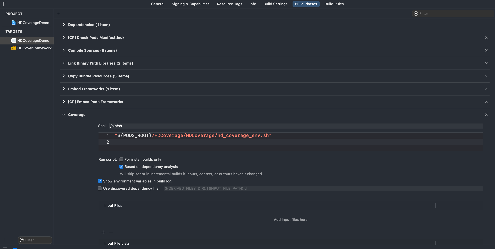
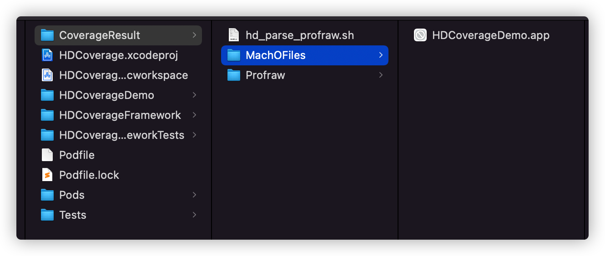
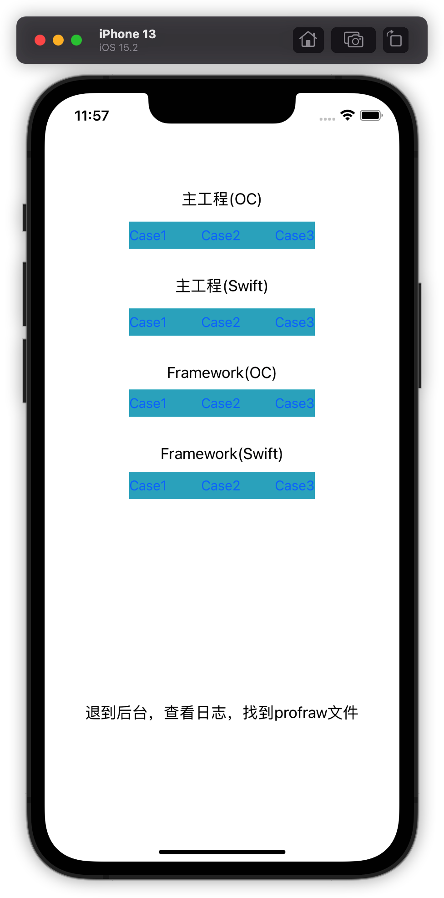
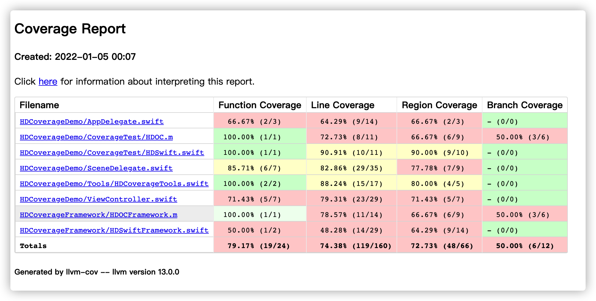
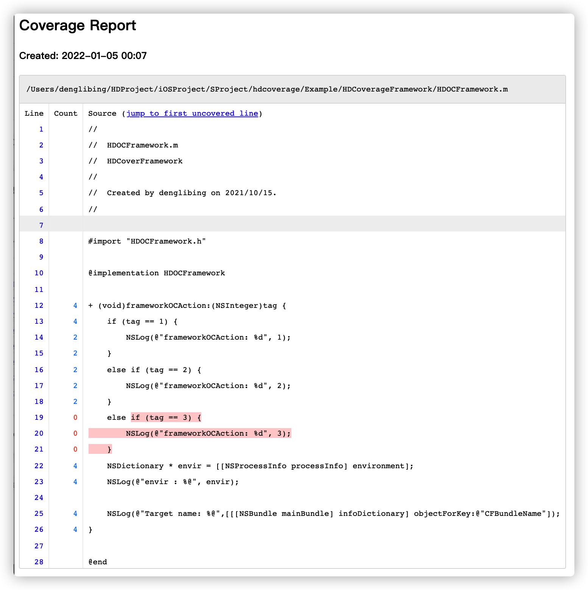

# HDCoverage

[](https://travis-ci.org/denglibing/HDCoverage)
[](https://cocoapods.org/pods/HDCoverage)
[](https://cocoapods.org/pods/HDCoverage)
[](https://cocoapods.org/pods/HDCoverage)

## 简介

这是一个统计基于 `Swift & Objective-C` 工程的代码覆盖率的自动化脚本。之所以做成 Pod ，是便于更好的复用，该 Pod 只包含了收集生成代码覆盖率的脚本。整体比较简单方便。

**这里只将流程，咱不讲原理。后续另外介绍**

**这里只将流程，咱不讲原理。后续另外介绍**

## 使用

**1、安装：** 通过 [CocoaPods](https://cocoapods.org) 进行安装，在你的 Podfile 文件添加如下代码：

```ruby
pod 'HDCoverage'
```

然后 `pod install` 安装下载相关脚本文件。

**2、关联脚本：** 在项目的 `Xcode` 的 `Build Phases` 添加新的脚本（`New Run Script Phase`）（App在Build会执行该脚本）:

```sh
"${PODS_ROOT}/HDCoverage/HDCoverage/hd_coverage_env.sh"
```



**3、工程配置代码覆盖率参数：** 这里本来是在 `HDCoverage` 有脚本支持的，但是基于对哪些模块（Pod作为独立模版）进行代码覆盖率，所以建议在 `Podfile` 自主添加如下代码灵活管理，详细说明如下：

```ruby
# 实现post_install Hooks
# 需要收集Code Coverage的模块
ntargets = Array['AFNetworking']

require 'xcodeproj'
post_install do |installer|
  # 修改Pods中某一个模块的配置文件，好采集代码覆盖率，需要源码！
  installer.pods_project.targets.each do |target|
    target.build_configurations.each do |config|
      if(config.name <=> 'Release') == 0
        config.build_settings['OTHER_CFLAGS'] = '$(inherited)'
        config.build_settings['OTHER_SWIFT_FLAGS'] = '$(inherited)'
        config.build_settings['OTHER_LDFLAGS'] = '$(inherited)'
        ntargets.each do |ntarget|
          if(ntarget <=> target.name) == 0
            config.build_settings['OTHER_CFLAGS'] = '$(inherited) -fprofile-instr-generate -fcoverage-mapping'
            config.build_settings['OTHER_SWIFT_FLAGS'] = '$(inherited) -profile-generate -profile-coverage-mapping'
            config.build_settings['OTHER_LDFLAGS'] = '$(inherited) -fprofile-instr-generate'
            break
          end
        end
        else
        config.build_settings['OTHER_CFLAGS'] = '$(inherited)'
        config.build_settings['OTHER_SWIFT_FLAGS'] = '$(inherited)'
        config.build_settings['OTHER_LDFLAGS'] = '$(inherited)'
      end
    end
  end
  
  # 修改主工程
  project_path = './HDCoverage.xcodeproj'
  project = Xcodeproj::Project.open(project_path)
  puts project
  project.targets.each do |target|
    if(target.name <=> 'HDCoverageDemo') == 0
      target.build_configurations.each do |config|
        if ((config.name <=> 'Release') == 0 || (config.name <=> 'Debug') == 0)
          # 设置预编译变量CODECOVERAGE
          config.build_settings['GCC_PREPROCESSOR_DEFINITIONS'] = '$(inherited) CODECOVERAGE=1'
          # OC代码覆盖率插桩配置
          config.build_settings['OTHER_CFLAGS'] = '$(inherited) -fprofile-instr-generate -fcoverage-mapping'
          # Swift代码覆盖率插桩配置
          config.build_settings['OTHER_SWIFT_FLAGS'] = '$(inherited) -profile-generate -profile-coverage-mapping'
          # 采集代码覆盖率配置
          config.build_settings['OTHER_LDFLAGS'] = '$(inherited) -fprofile-instr-generate'
          # Release需要设置，不然无法解析代码覆盖率
          config.build_settings['SWIFT_OPTIMIZATION_LEVEL'] = '-Onone'
          else
          config.build_settings['OTHER_CFLAGS'] = '$(inherited)'
          config.build_settings['OTHER_SWIFT_FLAGS'] = '$(inherited)'
          config.build_settings['OTHER_LDFLAGS'] = '$(inherited)'
          config.build_settings['SWIFT_OPTIMIZATION_LEVEL'] = ''
        end
      end
    end
  end
  project.save()
end
```

**4、代码执行数据收集：** 使用 `GCC` 无法满足 同时兼容 `Swift ` 和 `Objective-C` ，所以这里是基于 `LLVM` 进行，[官网文档](https://clang.llvm.org/docs/SourceBasedCodeCoverage.html) 。也可以参考笔者翻译的 [Source-based Code Coverage](https://blog.csdn.net/u012390519/article/details/121096466) ，完整详细的教程可以看 [Source-based Code Coverage for Swift Step by Step](https://nycode-jn.medium.com/source-based-code-coverage-for-swift-step-by-step-3df3c44c28d9)。

4.1、首先在工程中申明 `LLVM` 几个关键的函数：

```objc
#ifndef PROFILE_INSTRPROFILING_H_
#define PROFILE_INSTRPROFILING_H_

// https://clang.llvm.org/docs/SourceBasedCodeCoverage.html
int __llvm_profile_runtime = 0;
void __llvm_profile_initialize_file(void);
const char *__llvm_profile_get_filename(void);
void __llvm_profile_set_filename(const char *);
int __llvm_profile_write_file(void);
int __llvm_profile_register_write_file_atexit(void);
const char *__llvm_profile_get_path_prefix(void);
#endif /* PROFILE_INSTRPROFILING_H_ */
```

4.2、再次封装代码覆盖率相关API，便于上层更好使用（建议）：

```objc
class HDCoverageTools: NSObject {
    static var shared = HDCoverageTools()
 
    // 注意：动态库是需要单独注册，并且需要在动态库中执行__llvm_profile_write_file()
    func registerCoverage(moduleName: String) {
        let name = "\(moduleName).profraw"
        print("registerCoverage, moduleName: \(moduleName)")
        let fileManager = FileManager.default
        do {
            let documentDirectory = try fileManager.url(for: .documentDirectory, in: .userDomainMask, appropriateFor:nil, create:false)
            let filePath: NSString = documentDirectory.appendingPathComponent(name).path as NSString
            print("HDCoverageGather filePath: \(filePath)")
            __llvm_profile_set_filename(filePath.utf8String)
        } catch {
            print(error)
        }
        saveAndUpload()
    }
    
    // 合适的时机代码覆盖率上报
    func saveAndUpload() {
        __llvm_profile_write_file()
    }
}
```

4.3、启动时刻，注册代码覆盖率API：

```swift
func application(_ application: UIApplication, didFinishLaunchingWithOptions launchOptions: [UIApplication.LaunchOptionsKey: Any]?) -> Bool {
        HDCoverageTools.shared.registerCoverage(moduleName: "HDCoverageDemo")
        return true
}
```

4.4、在合适的时刻（按照大家的业务场景）将覆盖率数据写入制定的路径：

```swift
func sceneDidEnterBackground(_ scene: UIScene) {
        // 笔者这里测试，是在App进入后台后写入
        DispatchQueue.global().asyncAfter(deadline: .now() + 0.1) { [self] in
            HDCoverageTools.shared.saveAndUpload()
        }
    }
```

**5、测试以便生成覆盖率数据：** 以本工程的demo为例说明

5.1、在运行成功后，`Finder` 会自动弹出如下目录：



这里是在项目主工程生成 `CoverageResult` 目录，并且将生成代码覆盖率可视化的脚本 `hd_parse_profraw.sh` 拷贝到这里，将 项目 `HDCoverageDemo.app` 拷贝过来，主要是获取其 `Mach-O` :

```sh
$ tree -L 2
.
├── MachOFiles
│   └── HDCoverageDemo.app
├── Profraw
└── hd_parse_profraw.sh
```

5.2、执行测试用例，这里我分别点击了：`"主工程(OC)-Case1/Case2"、"主工程(Swift)-Case2/Case3"、"Framework(OC)-Case1/Case2"、"FrameworkSwift)-Case2/Case3"` 后，App退到后台



5.3、查看控制台，可以看到 profraw 文件：

```sh
registerCoverage, moduleName: HDCoverageDemo
HDCoverageGather filePath: /Users/denglibing/Library/Developer/CoreSimulator/Devices/5D01D4AA-40AE-4FC6-845C-391A94828EE3/data/Containers/Data/Application/283906A5-1681-44A5-8522-126D29D2F148/Documents/HDCoverageDemo.profraw
```

将 `HDCoverageDemo.profraw` 拷贝到 `CoverageResult/Profraw` 目录中；

5.4、执行 `hd_parse_profraw.sh` 脚本：

```sh
$ tree -L 2
.
├── MachOFiles
│   └── HDCoverageDemo.app
├── Profraw
│   └── HDCoverageDemo.profraw
└── hd_parse_profraw.sh

$ sh hd_parse_profraw.sh
CoverageResult: /Users/denglibing/HDProject/iOSProject/SProject/hdcoverage/Example/CoverageResult/CoverageResult 
machOFiles: /Users/denglibing/HDProject/iOSProject/SProject/hdcoverage/Example/CoverageResult/MachOFiles
/Users/denglibing/HDProject/iOSProject/SProject/hdcoverage/Example/CoverageResult/CoverageResult 不存在，已经创建
disposeProfrawFiles profraws: /Users/denglibing/HDProject/iOSProject/SProject/hdcoverage/Example/CoverageResult/Profraw
disposeProfrawFiles profraw file: HDCoverageDemo.profraw
===================================

findMachOFileName: HDCoverageDemo
findMachOFilePath: /Users/denglibing/HDProject/iOSProject/SProject/hdcoverage/Example/CoverageResult/MachOFiles/HDCoverageDemo.app/HDCoverageDemo
===================================

disposeProfrawToHtml, machoFileName: HDCoverageDemo machOFilePath: /Users/denglibing/HDProject/iOSProject/SProject/hdcoverage/Example/CoverageResult/MachOFiles/HDCoverageDemo.app/HDCoverageDemo
```

执行成功后将自动将可视化的代码覆盖率目录打开：

```sh
$ tree -L 3
.
├── CoverageResult
│   └── HDCoverageDemo
│       ├── coverage
│       ├── index.html
│       └── style.css
├── MachOFiles
│   └── HDCoverageDemo.app
│       ├── Base.lproj
│       ├── Frameworks
│       ├── HDCoverageDemo
│       ├── Info.plist
│       ├── PkgInfo
│       └── _CodeSignature
├── Profraw
│   ├── HDCoverageDemo.profdata
│   └── HDCoverageDemo.profraw
└── hd_parse_profraw.sh

9 directories, 8 files
```

5.5、查看：打开 `CoverageResult/HDCoverageDemo/index.html` 即可得到本次测试的代码覆盖率情况：



点击某一个 `Filename区域` 可以查看详情，例如点击 `HDOCFramework.m `:



可以看出，`tag == 3` 的代码行数并没有执行到，这正和上面测试的  `"Framework(OC)-Case1/Case2"` 符合。

## 参考

[Source-based Code Coverage for Swift Step by Step](https://nycode-jn.medium.com/source-based-code-coverage-for-swift-step-by-step-3df3c44c28d9) ： 非常详细的Swift代码覆盖率教程，受益匪浅。

[iOS 基于非Case的Code Coverage系统搭建](https://www.jianshu.com/p/a9679f47711c) : 基于对OC项目的代码覆盖率介绍，提供了脚本化思路，收益匪浅。

[llvm-profdata - Profile data tool](https://llvm.org/docs/CommandGuide/llvm-profdata.html#profdata-merge)： 用于处理生成profdata命令

[Source-based Code Coverage](https://clang.llvm.org/docs/SourceBasedCodeCoverage.html) ：llvm官网基于源码对Swift和OC进行代码覆盖率

[Source-based Code Coverage 中文版](https://blog.csdn.net/u012390519/article/details/121096466) ：llvm官网基于源码对Swift和OC进行代码覆盖率-笔者翻译（轻喷）


## License

HDCoverage is available under the MIT license. See the LICENSE file for more info.
